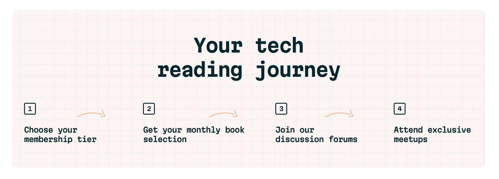

# Tech Book Club

## Table of Contents

- [Screenshot](#Screenshots)
- [My Process](#MyProcess)
- [Built With](#Builtwith)
- [What I learned](#Whatilearned)
- [What's Next](#WhatsNext)

### Screenshot
.png)

## My Process
I carefully went through the design and after that, i created some custom properties for the colors, fonts etc and started building the project.

- Opinion: I am really proud of this project. It makes me happy

## Built with
It was built with HTML & CSS, i didn't use SASS or any CSS Frameworks

## What I learned
The layout of the entire page was a bit challenging (It's basically different for mobile, tablet and desktop). The glow and gradients also had me stuck for a while, i don't know why they were put there in the first place.

## What's Next?? 
More learning,
More project building, 
 More improvement in all areas of my Tech Stack.

