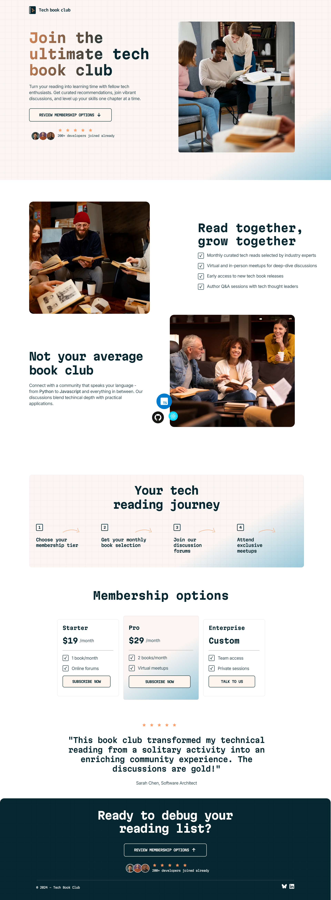
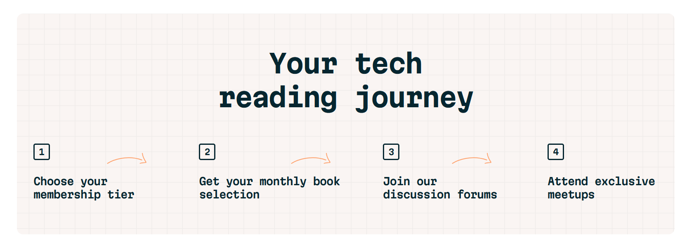
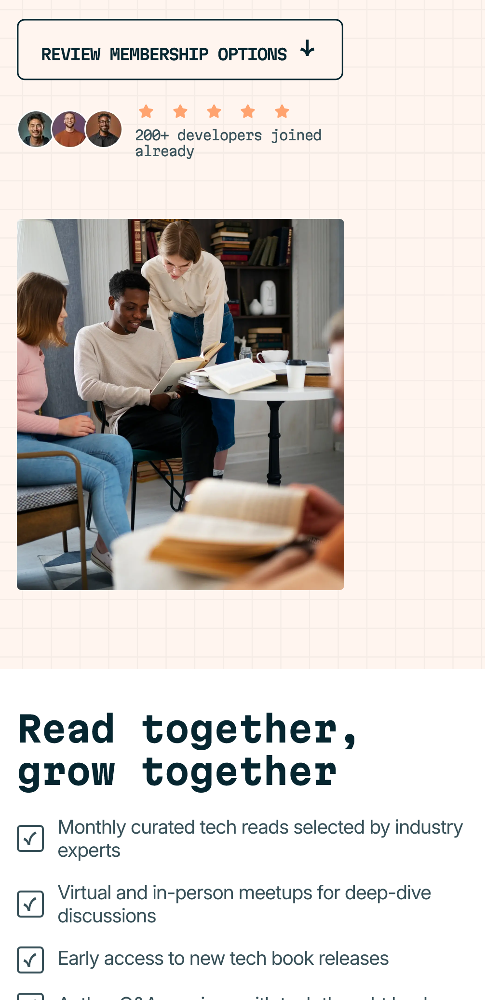

# Tech Book Club

## Table of Contents

- [Screenshot](#Screenshots)
- [My Process](#MyProcess)
- [Built With](#Builtwith)
- [What I learned](#Whatilearned)
- [What's Next](#WhatsNext)

### `Screenshot`

## `My Process`
I carefully went through the design and after that, i created some custom properties for the colors, fonts etc and started building the project.

## `Built with`
It was built with pure `HTML` & `CSS`, i didn't use `SASS` or any `CSS` Frameworks.

## `What I learned`
The layout of the entire page was a bit challenging (It's basically different for mobile, tablet and desktop). The `glow and gradients` also had me stuck for a while.

## Development issues
 The images on the page are not scaling properly, they remain at a `fixed width` when i try to adapt the project to different screen sizes which is annoying... 

 

## `What's Next??`
More learning,
More project building, 
 More improvements in all areas of my Tech Stack.

`Thanks for reading 👋.`